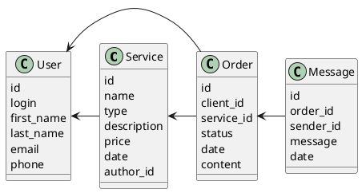

# Компонентная архитектура
<!-- Состав и взаимосвязи компонентов системы между собой и внешними системами с указанием протоколов, ключевые технологии, используемые для реализации компонентов.
Диаграмма контейнеров C4 и текстовое описание. 
-->
## Компонентная диаграмма

```plantuml
@startuml
!include https://raw.githubusercontent.com/plantuml-stdlib/C4-PlantUML/master/C4_Container.puml

AddElementTag("microService", $shape=EightSidedShape(), $bgColor="CornflowerBlue", $fontColor="white", $legendText="microservice")
AddElementTag("storage", $shape=RoundedBoxShape(), $bgColor="lightSkyBlue", $fontColor="white")

Person(admin, "Администратор")
Person(moderator, "Модератор")
Person(user, "Пользователь")

System_Ext(web_site, "Клиентский веб-сайт", "HTML, CSS, JavaScript, React", "Веб-интерфейс")

System_Boundary(conference_site, "Сайт блогов") {
   'Container(web_site, "Клиентский веб-сайт", ")
   Container(client_service, "Сервис авторизации", "C++", "Сервис управления пользователями", $tags = "microService")    
   Container(services_service, "Сервис услуг", "C++", "Сервис управления услугами", $tags = "microService") 
   Container(order_service, "Сервис заказов", "C++", "Сервис управления заказами", $tags = "microService")  
   Container(chat_service, "Сервис сообщенийй", "C++", "Сервис управления заказами", $tags = "microService")  
   ContainerDb(db, "База данных", "MySQL", "Хранение данных о услугах, заказах и чатах", $tags = "storage")
   
}

Rel(admin, web_site, "Просмотр, добавление и редактирование информации о пользователях, услугах и заказах")
Rel(moderator, web_site, "Модерация контента и пользователей")
Rel(user, web_site, "Регистрация, созание услуг, заказ услуг, общение с заказчиком/исполнителем")

Rel(web_site, client_service, "Работа с пользователями", "localhost/person")
Rel(client_service, db, "INSERT/SELECT/UPDATE", "SQL")

Rel(web_site, services_service, "Работа с услугами", "localhost/pres")
Rel(services_service, db, "INSERT/SELECT/UPDATE", "SQL")

Rel(web_site, order_service, "Работа с заказами", "localhost/conf")
Rel(order_service, db, "INSERT/SELECT/UPDATE", "SQL")

Rel(web_site, chat_service, "Работа с чатами", "localhost/conf")
Rel(chat_service, db, "INSERT/SELECT/UPDATE", "SQL")

@enduml
```
## Список компонентов  

### Сервис авторизации
**API**:
-	Создание нового пользователя
      - входные параметры: login, пароль, имя, фамилия, email, телефон
      - выходные параметры: идентефикатор пользователя
-	Поиск пользователя по логину
     - входные параметры:  login
     - выходные параметры: имя, фамилия, email, телефон
-	Поиск пользователя по маске имени и фамилии
     - входные параметры: маска фамилии, маска имени
     - выходные параметры: login, имя, фамилия, email, телефон

### Сервис услуг
**API**:
- Создание услуги
  - Входные параметры: название услуги, категория, цена, описание, автор и дата создания
  - Выходыне параметры: идентификатор услуги
- Редактирование услуги
  - Входные параметры: идентификатор услуги, ???
  - Выходыне параметры: отсутствует
- Удаление услуги
  - Входные параметры: идентификатор услуги
  - Выходыне параметры: отсутствует
- Получение услуги:
  - Входные параметры: идентификатор услуги
  - Выходыне параметры: название услуги, категория, цена, описание, автор и дата создания
-	Поиск услги по маске названия
     - входные параметры: маска названия, категория
     - выходные параметры: массив с услугами, где для каждого указаны его идентификатор, название услуги, категория, цена, описание, автор и дата создания
- Получение списка всех услуг
  - Входные параметры: отсутствуют
  - Выходные параметры: массив с услугами, где для каждого указаны его идентификатор, название услуги, категория, цена, описание, автор и дата создания

### Сервис заказов
**API**:
- Создание заказа
  - Входные параметры: идентефикатор услуги, идентификатор клиента(получателя услуги), дата создания
  - Выходные параметры: идентификатор заказа
- Изменение статуса заказа
  - Входные параметры: идентификатор заказа, статус заказа
  - Выходные параметры: отсутствует
- Получение заказа
  - Входнае параметры: идентификатор заказа
  - Выходные парамтеры: идентификатор услуги, идентефикатор клиента, статус заказа, дата создания
- Получение заказов клиента
  - Входнае параметры: идентификатор пользователя
  - Выходные парамтеры: массив с идентификаторами заказа

### Сервис сообщенийй
**API**:
- Получение чата
  - Входные параметры: идентификатор заказа
  - Выходные параметры: массив с сообщениями
- Отправление сообщения
  - Входнае параметры: идентификатор чата, идентефикатор пользователя, сообщение, дата и время
  - Выходные парамтеры: идентефикатор сообщения


### Модель данных
